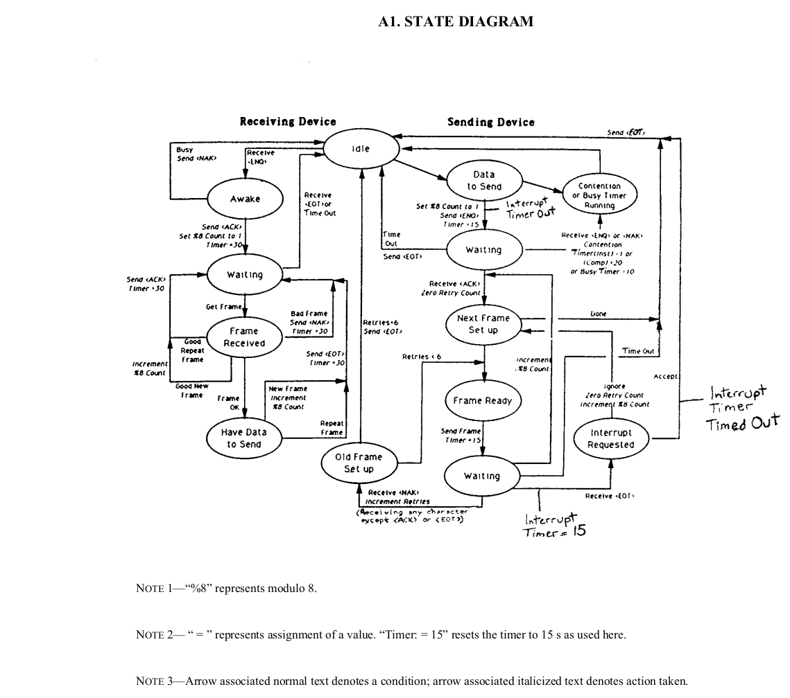

# **Analyzer client or analyzer test server**

## Description

On the one hand, the project can act as a client for working with the analyzer (jar library), on the other hand, it implements a test analyzer with a strictly defined scenario.

Проект с одной стороны может выступать как клиент для работы с анализатором (библиотека jar),
с другой стороны он реализует тестовый анализатор со строго определенным ссценарием.


### TODO CLSI LIS1-A (formerly ASTM E1381)

- [x] TCP/IP (Reactor Netty)
- [ ] COM
- [ ] SMB

## Getting Started

Requires Java >= 8 (Требуется Java >= 8).

To build, you can enter the command (Для сборки можно ввести команду) :

```bash
# windows
gradlew.bat build

#linux
./gradlew build
```

For testing and code coverage reporting (Для тестирования и отчета об покрытии кода):
```bash
# windows
gradlew.bat test jacocoTestReport 

#linux
./gradlew test jacocoTestReport 
```

For testing and code coverage reporting (Для тестирования и отчета об покрытии кода):
```bash
# windows
gradlew.bat test jacocoTestReport 

#linux
./gradlew test jacocoTestReport 
```

## Example

### Client

```java
    //for send messages to analyzer
    Sinks.Many<byte[]> flowMessagesForAnalyzer = Sinks
                                                    .many()
                                                    .multicast()
                                                    .onBackpressureBuffer();


    TCP clientTCPanalyzer = TCPBuilder
                                .builder(TypeSideCommunication.CLIENT, port)
                                .setHost(host)
                                .setMessageFlowForNetwork(flowMessagesForAnalyzer.asFlux())
                                .build();

    Flux<byte[]> flowMessagesFromAnalyzer = clientTCPanalyzer.getMessageFlowFromNetwork();

    ...

    flowMessagesForAnalyzer.tryEmitNext("ASTM 1394 or another")

```

### Server

```java
    Path scenario = Paths.get("src", "test", "resources", "scenario");

    TCP serverTCPanalyzer = TCPBuilder
                                .builder(TypeSideCommunication.SERVER, port)
                                .setScenario(scenario)
                                .build();
```

scenario:

```
@send fully withouterror 0D
H|\!~|(0:0-144795890#123476669, 571)||DxH|||||LIS||P|LIS2-A|20211028082630
Q|1|!000004287888||ALL||||||||O
L|1|N
@send parts witherror 2 0D
H|\!~|(0:0-144795891#299290512, 571)||DxH|||||LIS||P|LIS2-A|20211028082637
Q|1|!000004287934||ALL||||||||O
L|1|N
@send fully witherror 5 0D
H|\!~|(0:0-144795892#305747308, 571)||DxH|||||LIS||P|LIS2-A|20211028082643
Q|1|!000004287945||ALL||||||||O
L|1|N
@receive withNAK withouterror 0D
H|\!~|(0:0-144795890#123476669, 571)||DxH|||||LIS||P
P|1||401791||||19770624!44!Y|F
O|1|000004287888||!!!CD|R||||||N||||Whole blood
L|1|N
@receive withoutNAK witherror 5 0D
H|\!~|(0:0-144795890#123476669, 571)||DxH|||||LIS||P
P|1||401791||||19770624!44!Y|F
O|1|000004287934||!!!CD|R||||||N||||Whole blood
L|1|N
@receive withNAK witherror 1 0D
H|\!~|(0:0-144795892#305747308, 571)||DxH|||||LIS||P
P|1||511012||||19670122!54!Y|F
O|1|000004287945||!!!CD|R||||||N||||Whole blood
L|1|N
@send parts witherror 2 0D
H|\!~|||DxH|||||LIS||P|LIS2-A|20211028082841
P|1||401791||||19770624!44!Y|F
O|1|000004287888|00026|!!!CD|R|||||||||20211028082635|Whole blood|||||!SYSTEM||20211028082838|||F
C|1|I|Test names beginning with @ are research use only. Not for use in diagnostics procedures.|G
R|1|!!!WBC!33256-9|7.4|10^9/L||3.8 to 11.8|||F||SYSTEM||20211028082826|AY52686
R|2|!!!UWBC!6690-2|7.4|10^9/L|||||F||SYSTEM||20211028082826|AY52686
R|3|!!!RBC!789-8|4.65|10^12/L||3.63 to 4.92|||F||SYSTEM||20211028082826|AY52686
R|4|!!!HGB!718-7|146!  H |g/L||109 to 143|A||F||SYSTEM||20211028082826|AY52686
R|5|!!!HCT!4544-3|42.2!  H |%||31.2 to 41.9|A||F||SYSTEM||20211028082826|AY52686
R|6|!!!MCV!787-2|90.8|fL||75.5 to 95.3|||F||SYSTEM||20211028082826|AY52686
R|7|!!!MCH!785-6|31.4|pg||24.7 to 32.8|||F||SYSTEM||20211028082826|AY52686
R|8|!!!MCHC!786-4|34.6|g/dL||32.3 to 35.6|||F||SYSTEM||20211028082826|AY52686
R|9|!!!RDW!788-0|14.2|%||12.3 to 17.7|||F||SYSTEM||20211028082826|AY52686
R|10|!!!RDW-SD!21000-5|45.5|fL||37.6 to 50.3|||F||SYSTEM||20211028082826|AY52686
R|11|!!!PLT!777-3|378|10^9/L||179 to 408|||F||SYSTEM||20211028082826|AY52686
R|12|!!!MPV!32623-1|8.2|fL||7.9 to 10.8|||F||SYSTEM||20211028082826|AY52686
R|13|!!!@PCT|0.312|%|||||F||SYSTEM||20211028082826|AY52686
R|14|!!!@PDW!32207-3|16.9||||||F||SYSTEM||20211028082826|AY52686
R|15|!!!NE!770-8|62.3|%||42.7 to 76.8|||F||SYSTEM||20211028082826|AY52686
R|16|!!!LY!736-9|26.1|%||16.0 to 45.9|||F||SYSTEM||20211028082826|AY52686
R|17|!!!MO!5905-5|6.5|%||4.3 to 10.9|||F||SYSTEM||20211028082826|AY52686
R|18|!!!EO!713-8|4.1|%||0.5 to 7.0|||F||SYSTEM||20211028082826|AY52686
R|19|!!!BA!706-2|1.0|%||0.2 to 1.3|||F||SYSTEM||20211028082826|AY52686
R|20|!!!NE#!751-8|4.6|10^9/L||1.9 to 8.2|||F||SYSTEM||20211028082826|AY52686
R|21|!!!LY#!731-0|1.9|10^9/L||1.1 to 3.1|||F||SYSTEM||20211028082826|AY52686
R|22|!!!MO#!742-7|0.5|10^9/L||0.2 to 0.9|||F||SYSTEM||20211028082826|AY52686
R|23|!!!EO#!711-2|0.3|10^9/L||0.0 to 0.5|||F||SYSTEM||20211028082826|AY52686
R|24|!!!BA#!704-7|0.1|10^9/L||0.0 to 0.1|||F||SYSTEM||20211028082826|AY52686
R|25|!!!NRBC!34200-6|0.0|/100WBC||0.0 to 0.3|||F||SYSTEM||20211028082826|AY52686
R|26|!!!NRBC#!771-6|0.00|10^9/L||0.00 to 0.02|||F||SYSTEM||20211028082826|AY52686
R|27|!!!@EGC|0.4|%|||||F||SYSTEM||20211028082826|AY52686
R|28|!!!@EGC#|0.0|10^9/L|||||F||SYSTEM||20211028082826|AY52686
L|1|N
@send fully witherror 5 0D
H|\!~|||DxH|||||LIS||P|LIS2-A|20211028082923
P|1||524358||||19730310!48!Y|F
O|1|000004287934|00027|!!!CD|R|||||||||20211028082642|Whole blood|||||!SYSTEM||20211028082920|||F
C|1|I|Test names beginning with @ are research use only. Not for use in diagnostics procedures.|G
R|1|!!!WBC!33256-9|4.4|10^9/L||3.8 to 11.8|||F||SYSTEM||20211028082908|AY52686
R|2|!!!UWBC!6690-2|4.4|10^9/L|||||F||SYSTEM||20211028082908|AY52686
R|3|!!!RBC!789-8|3.87|10^12/L||3.63 to 4.92|||F||SYSTEM||20211028082908|AY52686
R|4|!!!HGB!718-7|122|g/L||109 to 143|||F||SYSTEM||20211028082908|AY52686
R|5|!!!HCT!4544-3|35.0|%||31.2 to 41.9|||F||SYSTEM||20211028082908|AY52686
R|6|!!!MCV!787-2|90.5|fL||75.5 to 95.3|||F||SYSTEM||20211028082908|AY52686
R|7|!!!MCH!785-6|31.6|pg||24.7 to 32.8|||F||SYSTEM||20211028082908|AY52686
R|8|!!!MCHC!786-4|35.0|g/dL||32.3 to 35.6|||F||SYSTEM||20211028082908|AY52686
R|9|!!!RDW!788-0|13.2|%||12.3 to 17.7|||F||SYSTEM||20211028082908|AY52686
R|10|!!!RDW-SD!21000-5|41.6|fL||37.6 to 50.3|||F||SYSTEM||20211028082908|AY52686
R|11|!!!PLT!777-3|178!  L |10^9/L||179 to 408|A||F||SYSTEM||20211028082908|AY52686
R|12|!!!MPV!32623-1|10.1|fL||7.9 to 10.8|||F||SYSTEM||20211028082908|AY52686
R|13|!!!@PCT|0.179|%|||||F||SYSTEM||20211028082908|AY52686
R|14|!!!@PDW!32207-3|17.8||||||F||SYSTEM||20211028082908|AY52686
R|15|!!!NE!770-8|46.1|%||42.7 to 76.8|||F||SYSTEM||20211028082908|AY52686
R|16|!!!LY!736-9|41.0|%||16.0 to 45.9|||F||SYSTEM||20211028082908|AY52686
R|17|!!!MO!5905-5|9.8|%||4.3 to 10.9|||F||SYSTEM||20211028082908|AY52686
R|18|!!!EO!713-8|2.4|%||0.5 to 7.0|||F||SYSTEM||20211028082908|AY52686
R|19|!!!BA!706-2|0.7|%||0.2 to 1.3|||F||SYSTEM||20211028082908|AY52686
R|20|!!!NE#!751-8|2.0|10^9/L||1.9 to 8.2|||F||SYSTEM||20211028082908|AY52686
R|21|!!!LY#!731-0|1.8|10^9/L||1.1 to 3.1|||F||SYSTEM||20211028082908|AY52686
R|22|!!!MO#!742-7|0.4|10^9/L||0.2 to 0.9|||F||SYSTEM||20211028082908|AY52686
R|23|!!!EO#!711-2|0.1|10^9/L||0.0 to 0.5|||F||SYSTEM||20211028082908|AY52686
R|24|!!!BA#!704-7|0.0|10^9/L||0.0 to 0.1|||F||SYSTEM||20211028082908|AY52686
R|25|!!!NRBC!34200-6|0.0|/100WBC||0.0 to 0.3|||F||SYSTEM||20211028082908|AY52686
R|26|!!!NRBC#!771-6|0.00|10^9/L||0.00 to 0.02|||F||SYSTEM||20211028082908|AY52686
R|27|!!!@EGC|0.5|%|||||F||SYSTEM||20211028082908|AY52686
R|28|!!!@EGC#|0.0|10^9/L|||||F||SYSTEM||20211028082908|AY52686
L|1|N
@send fully withouterror 0D
H|\!~|||DxH|||||LIS||P|LIS2-A|20211028083003
P|1||511012||||19670122!54!Y|F
O|1|000004287945|00028|!!!CD|R|||||||||20211028082648|Whole blood|||||!SYSTEM||20211028083000|||F
C|1|I|Test names beginning with @ are research use only. Not for use in diagnostics procedures.|G
R|1|!!!WBC!33256-9|5.3|10^9/L||3.8 to 11.8|||F||SYSTEM||20211028082948|AY52686
R|2|!!!UWBC!6690-2|5.3|10^9/L|||||F||SYSTEM||20211028082948|AY52686
R|3|!!!RBC!789-8|4.09|10^12/L||3.63 to 4.92|||F||SYSTEM||20211028082948|AY52686
R|4|!!!HGB!718-7|127|g/L||109 to 143|||F||SYSTEM||20211028082948|AY52686
R|5|!!!HCT!4544-3|35.9|%||31.2 to 41.9|||F||SYSTEM||20211028082948|AY52686
R|6|!!!MCV!787-2|87.8|fL||75.5 to 95.3|||F||SYSTEM||20211028082948|AY52686
R|7|!!!MCH!785-6|31.0|pg||24.7 to 32.8|||F||SYSTEM||20211028082948|AY52686
R|8|!!!MCHC!786-4|35.3|g/dL||32.3 to 35.6|||F||SYSTEM||20211028082948|AY52686
R|9|!!!RDW!788-0|12.4|%||12.3 to 17.7|||F||SYSTEM||20211028082948|AY52686
R|10|!!!RDW-SD!21000-5|38.1|fL||37.6 to 50.3|||F||SYSTEM||20211028082948|AY52686
R|11|!!!PLT!777-3|226|10^9/L||179 to 408|||F||SYSTEM||20211028082948|AY52686
R|12|!!!MPV!32623-1|8.3|fL||7.9 to 10.8|||F||SYSTEM||20211028082948|AY52686
R|13|!!!@PCT|0.188|%|||||F||SYSTEM||20211028082948|AY52686
R|14|!!!@PDW!32207-3|16.2||||||F||SYSTEM||20211028082948|AY52686
R|15|!!!NE!770-8|52.5|%||42.7 to 76.8|||F||SYSTEM||20211028082948|AY52686
R|16|!!!LY!736-9|34.4|%||16.0 to 45.9|||F||SYSTEM||20211028082948|AY52686
R|17|!!!MO!5905-5|9.8|%||4.3 to 10.9|||F||SYSTEM||20211028082948|AY52686
R|18|!!!EO!713-8|2.3|%||0.5 to 7.0|||F||SYSTEM||20211028082948|AY52686
R|19|!!!BA!706-2|1.0|%||0.2 to 1.3|||F||SYSTEM||20211028082948|AY52686
R|20|!!!NE#!751-8|2.8|10^9/L||1.9 to 8.2|||F||SYSTEM||20211028082948|AY52686
R|21|!!!LY#!731-0|1.8|10^9/L||1.1 to 3.1|||F||SYSTEM||20211028082948|AY52686
R|22|!!!MO#!742-7|0.5|10^9/L||0.2 to 0.9|||F||SYSTEM||20211028082948|AY52686
R|23|!!!EO#!711-2|0.1|10^9/L||0.0 to 0.5|||F||SYSTEM||20211028082948|AY52686
R|24|!!!BA#!704-7|0.1|10^9/L||0.0 to 0.1|||F||SYSTEM||20211028082948|AY52686
R|25|!!!NRBC!34200-6|0.1|/100WBC||0.0 to 0.3|||F||SYSTEM||20211028082948|AY52686
R|26|!!!NRBC#!771-6|0.00|10^9/L||0.00 to 0.02|||F||SYSTEM||20211028082948|AY52686
R|27|!!!@EGC|0.3|%|||||F||SYSTEM||20211028082948|AY52686
R|28|!!!@EGC#|0.0|10^9/L|||||F||SYSTEM||20211028082948|AY52686
L|1|N
```
where
* @send - frame to send
* fully or parts - The message is transmitted in whole or in parts (for a test server-analyzer) (Передается сообщение полностью или частями (для тестового сервер-анализатора))
* witherror number or withouterror - how many times do you need to emulate the error in the last message? (сколько раз нужно эмулировать ошибку в последнем сообщении?)
* 0D - char end line (HEX)
* @receive - received frame 

See more in */src/test/**

Подробнее смотрите в */src/test/**

## Interaction scheme


## Docker image test server

There is a [docker image](https://hub.docker.com/r/chistousov/analyzer-test-server) for the test server

Для тестового сервера существует [образ docker](https://hub.docker.com/r/chistousov/analyzer-test-server)

```bash
docker run \
    -d \
    -m 512M \
    --log-opt max-size=100m \
    --log-opt max-file=1 \
    --name analyzer-server \
    --mount type=bind,source=/path/to/file/scenario,target=/analyzer_server/scenario,readonly \
    -p 8080:8888 \
    chistousov/analyzer-test-server:0.1.1
```

<hr>

## Creators

Nikita Konstantinovich Chistousov 

chistousov.nik@yandex.ru

## License

MIT